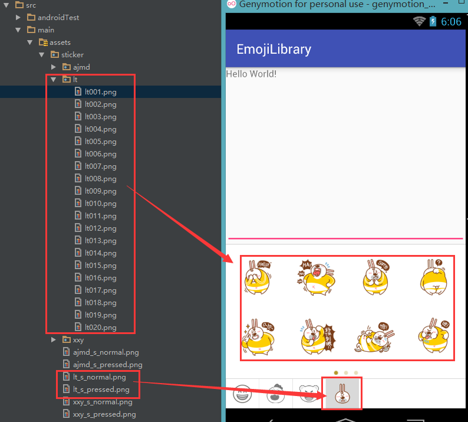
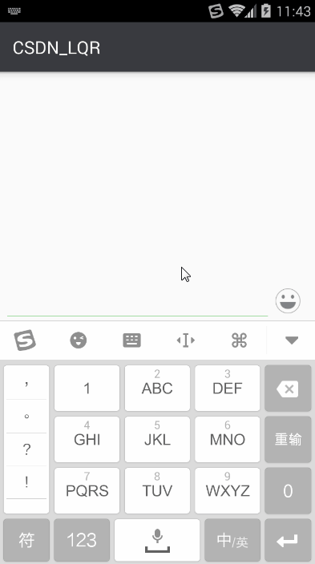

# LQREmojiLibrary
网易云信表情功能抽离，支持经典表情及贴图，加入仿微信软键盘切换时平滑过渡

##***一、引用初始化***

###1、在自定义的Application使用LQRUIKit进行初始化

	public class App extends Application {
	
	    @Override
	    public void onCreate() {
	        super.onCreate();
			... your code ...

	        LQRUIKit.init(getApplicationContext());

			... your code ...
	    }
	}

###2、在AndroidManifest.xml中引用自定义的Application

	<application
        android:name=".App"
        android:theme="@style/AppTheme">
        
    </application>

##***二、表情与贴图功能集成***

###1、在需要集成表情的功能的布局中设置以下代码

	<LinearLayout
	    xmlns:android="http://schemas.android.com/apk/res/android"
	    xmlns:tools="http://schemas.android.com/tools"
	    android:id="@+id/activity_main"
	    android:layout_width="match_parent"
	    android:layout_height="match_parent"
	    android:orientation="vertical"
	    tools:context="com.lqr.MainActivity">
	
		... your code ...
	
		<!--文本表情输入框-->
	    <EditText
	        android:id="@+id/messageEditText"
	        android:layout_width="match_parent"
	        android:layout_height="wrap_content"/>
	
		<!--表情、贴图控件-->
	    <com.lqr.emoji.EmoticonPickerView
	        android:id="@+id/epv"
	        android:layout_width="wrap_content"
	        android:layout_height="180dp"/>
	</LinearLayout>

###2、代码中使用（看注释）
		
		messageEditText = (EditText) findViewById(R.id.messageEditText);
        mEpv = (EmoticonPickerView) findViewById(R.id.epv);

        mEpv.setWithSticker(true);//开启贴图功能
        mEpv.show(this);//显示表情视图并设置监听
        mEpv.attachEditText(messageEditText);//把EditText交给EmoticonPickerView控制

		mEpv.setVisibility(View.VISIBLE);//开关表情贴图控件

###3、常用方法说明
####1)EmoticonPickerView

	1. attachEditText:将EditText交给EmotionView保管，点击表情时自动插入表情
	2. setWithSticker:是否开启贴图功能
	3. show(IEmoticonSelectedListener listener):显示表情视图并设置点击监听（监听表情、贴图的点击事件）

####2)MoonUtil

	1. replaceEmoticons:EditText用来转换表情文字的方法，如果没有使用EmoticonPickerView的attachEditText方法，则需要开发人员手动调用方法来又识别EditText中的表情
	2. identifyFaceExpression:识别表情(RecyclerView或ListView中的item显示时会用到，以下一样)
	3. identifyFaceExpressionAndATags：识别表情和标签（如：只需显示a标签对应的文本）
	4. identifyFaceExpression：识别表情，可设置缩放大小
	5. identifyFaceExpressionAndTags：识别表情和标签（如：只需显示a标签对应的文本），可设置缩放大小

例子：

	1. MoonUtil.identifyFaceExpression(getActivity(), tvMsg, content, ImageSpan.ALIGN_BOTTOM);//表情正常大小显示
	2. MoonUtil.identifyFaceExpression(getActivity(), tvMsg, content, ImageSpan.ALIGN_BOTTOM, 4.5f);//表情缩放显示

####3)StickerManager
	1. getStickerBitmapUri:根据目录名（catalog）和贴图名（chartlet）得到对应贴图在asset中的uri
	
例子：
	
	1. String uri = StickerManager.getInstance().getStickerBitmapUri(attachment.getCatalog(), attachment.getChartlet());

###4、注意
1. 该库使用了universal-image-loader。所以如果在项目中不要再次引入universal-image-loader。
2. 该库可以自定义贴图表情，但是写死了表情的类别名，分别是：ajmd、xxy、lt（在StickerManager类中定义的）。贴图需要放在自己工程的assets目录即可。一类贴图需要一个文件夹（存放贴图）和两张底部图片，注意命名规则，关系如下图：

##***三、仿微信软键盘出现时输入框高度不变***
EmotionKeyboard这个类可以模仿微信的切换软键盘与表情控件时不出现跳闪，真正做到平滑过渡。
	

	/**
     * 初始化表情软键盘
     */
    private void initEmotionKeyboard() {
		//1、创建EmotionKeyboard对象
        mEmotionKeyboard = EmotionKeyboard.with(this);
		//2、绑定输入框控件
        mEmotionKeyboard.bindToEditText(mEtContent);
		//3、绑定输入框上面的消息列表控件（这里用的是RecyclerView，其他控件也可以，注意该控件是会影响输入框位置的控件）
        mEmotionKeyboard.bindToContent(mCvMessage);
		//4、绑定输入框下面的底部区域（这里是把表情区和功能区共放在FrameLayout下，所以绑定的控件是FrameLayout）
		mEmotionKeyboard.setEmotionView(mFlButtom);
		//5、绑定表情按钮（可以绑定多个，如微信就有2个，一个是表情按钮，一个是功能按钮）
        mEmotionKeyboard.bindToEmotionButton(mIvEmo, mIvAdd);
        //6、当在第5步中绑定了多个EmotionButton时，这里的回调监听的view就有用了，注意是为了判断是否要自己来控制底部的显隐，还是交给EmotionKeyboard控制
        mEmotionKeyboard.setOnEmotionButtonOnClickListener(new EmotionKeyboard.OnEmotionButtonOnClickListener() {
            @Override
            public boolean onEmotionButtonOnClickListener(View view) {
                if (mBtnVoice.getVisibility() == View.VISIBLE) {
                    hideBtnVoice();
                }
                //输入框底部显示时
                if (mFlButtom.getVisibility() == View.VISIBLE) {
                    //表情控件显示而点击的按钮是ivAdd时，拦截事件，隐藏表情控件，显示功能区
                    if (mEpv.getVisibility() == View.VISIBLE && view.getId() == R.id.ivAdd) {
                        mEpv.setVisibility(View.GONE);
                        mLlButtomFunc.setVisibility(View.VISIBLE);
                        return true;
                        //功能区显示而点击的按钮是ivEmo时，拦截事件，隐藏功能区，显示表情控件
                    } else if (mLlButtomFunc.getVisibility() == View.VISIBLE && view.getId() == R.id.ivEmo) {
                        mEpv.setVisibility(View.VISIBLE);
                        mLlButtomFunc.setVisibility(View.GONE);
                        return true;
                    }
                } else {
                    //点击ivEmo，显示表情控件
                    if (view.getId() == R.id.ivEmo) {
                        mEpv.setVisibility(View.VISIBLE);
                        mLlButtomFunc.setVisibility(View.GONE);
                        //点击ivAdd，显示功能区
                    } else {
                        mEpv.setVisibility(View.GONE);
                        mLlButtomFunc.setVisibility(View.VISIBLE);
                    }
                }
                return false;
            }
        });
    }

上面回调中的内容是我自己仿微信项目中的代码（不是当前项目中的例子！！），开发中需要根据自己项目的需求来编码，这里不去掉是为了帮助需要的人理解该回调的作用。最后附上效果图：

